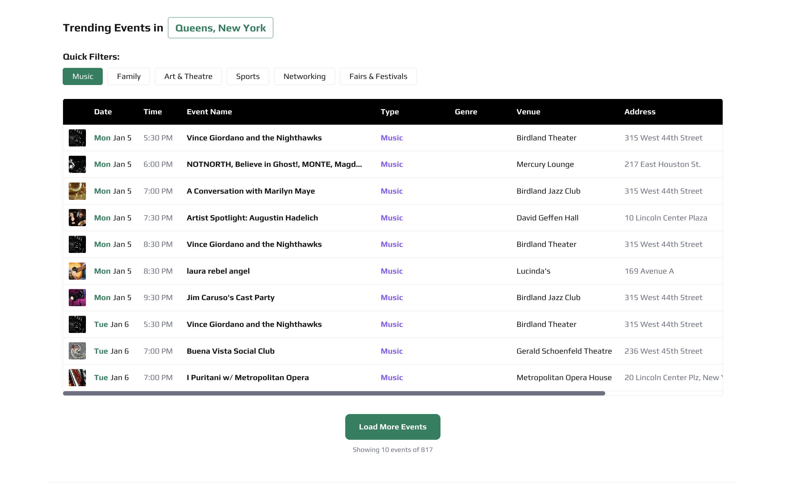
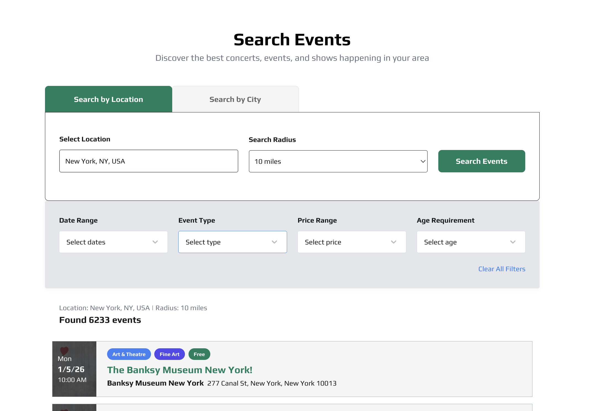

<p align="center">
  
</p>

<h1 align="center">🎉 House The Party</h1>

<p align="center">
  <strong>A nationwide events discovery platform serving 100K+ events with <300ms search latency</strong>
</p>

<p align="center">
  <a href="https://housetheparty.com">Live Demo</a> •
  <a href="#architecture">Architecture</a> •
  <a href="#features">Features</a> •
  <a href="#performance">Performance</a>
</p>

<p align="center">
  
  
  
  
  
  
</p>

---

## 📌 Overview

**House The Party** is a full-stack events discovery platform that aggregates 100,000+ nationwide events from multiple data sources, providing users with a fast, location-aware search experience. The platform achieves **<300ms search latency** and attracts **5K+ monthly organic visitors** through comprehensive SEO optimization.

### Key Metrics

| Metric                  | Value            |
| ----------------------- | ---------------- |
| Total Events Indexed    | 100,000+         |
| Search Latency (P95)    | <300ms           |
| Monthly Organic Traffic | 5,000+           |
| Artists/DJs Indexed     | 10,000+          |
| States Covered          | All 50 US States |

### Platform Preview

<p align="center">
  
  <br />
  <em>Main page featuring location-based event discovery with real-time search</em>
</p>

---

## 🏗️ Architecture

<p align="center">
  
</p>

```
┌─────────────────────────────────────────────────────────────────────────────┐
│                              FRONTEND                                       │
│  ┌─────────────────────────────────────────────────────────────────────┐    │
│  │  Next.js 15 (App Router) + React 19 + TypeScript                    │    │
│  │  ├── Server Components (SSR/SSG for SEO)                            │    │
│  │  ├── Client Components (Interactive UI)                             │    │
│  │  ├── TanStack Query (Data Caching & Sync)                           │    │
│  │  └── TailwindCSS + CSS Modules (Styling)                            │    │
│  └─────────────────────────────────────────────────────────────────────┘    │
│                                    │                                        │
│                                    ▼                                        │
├─────────────────────────────────────────────────────────────────────────────┤
│                              API LAYER                                      │
│  ┌─────────────────────────────────────────────────────────────────────┐    │
│  │  Next.js API Routes (40+ Endpoints)                                 │    │
│  │  ├── /api/events/* (Search, CRUD, Nearby Events)                    │    │
│  │  ├── /api/articles/* (CMS, Categories, Headlines)                   │    │
│  │  ├── /api/venues/* (Venue Discovery by State/City)                  │    │
│  │  ├── /api/artist-ranking/* (Artist/DJ Rankings)                     │    │
│  │  └── /api/places-* (Google Places Integration)                      │    │
│  └─────────────────────────────────────────────────────────────────────┘    │
│                                    │                                        │
│                                    ▼                                        │
├─────────────────────────────────────────────────────────────────────────────┤
│                           DATA & SERVICES                                   │
│  ┌───────────────┐  ┌───────────────┐  ┌───────────────┐  ┌─────────────┐   │
│  │   Supabase    │  │   Firebase    │  │   Pinecone    │  │   OpenAI    │   │
│  │  PostgreSQL   │  │     Auth      │  │   Vector DB   │  │    API      │   │
│  │   + PostGIS   │  │   Firestore   │  │  (RAG/LLM)    │  │  (Content)  │   │
│  └───────────────┘  └───────────────┘  └───────────────┘  └─────────────┘   │
│                                    │                                        │
│                                    ▼                                        │
├─────────────────────────────────────────────────────────────────────────────┤
│                           ETL PIPELINES                                     │
│  ┌─────────────────────────────────────────────────────────────────────┐    │
│  │  Linux VM Hosted ETL (Python + SQL)                                 │    │
│  │  ├── Event Data Aggregation (Ticketmaster, Dice, Custom Sources)    │    │
│  │  ├── Data Normalization & Deduplication                             │    │
│  │  ├── Geospatial Coordinate Enrichment                               │    │
│  │  └── Scheduled Jobs (Cron + Systemd)                                │    │
│  └─────────────────────────────────────────────────────────────────────┘    │
└─────────────────────────────────────────────────────────────────────────────┘
```

---

## ✨ Features

### 🔍 Intelligent Event Search

- **Geospatial Queries**: PostGIS-powered location-based search with configurable radius (5-100 miles)
- **IP Geolocation**: Automatic user location detection for personalized results
- **Multi-filter Support**: Genre, price range, age requirements, date range
- **Real-time Search**: <300ms response time with optimized database indexes

<p align="center">
  
  <br />
  <em>Demonstrating the <300ms search latency with real-time filtering and results</em>
</p>

### 📰 Integrated News/Blog CMS

- **Rich Text Editor**: Custom TipTap implementation with image uploads, captions, and formatting
- **Category System**: 12 content categories (Crime, Music, Nightlife, Events, etc.)
- **Homepage Curation**: Headline and front-page article selection system
- **SEO-Optimized**: Automatic meta tags, Open Graph, Twitter Cards, JSON-LD structured data

### 🎤 Artist & DJ Rankings

- **10,000+ Artists**: Comprehensive database of artists across all genres
- **Filterable Rankings**: Search by name, genre, country, record label
- **Artist Profiles**: Individual pages with event history and details

### 🏢 Venue Discovery

- **Nationwide Coverage**: Bars, clubs, and event venues across all 50 states
- **Google Places Integration**: Autocomplete and venue details
- **City-based Navigation**: Hierarchical state → city → venue browsing

### 👤 User Features

- **Multi-Provider Auth**: Google, Apple, Email/Password authentication
- **Email Verification**: Secure verification flow with resend functionality
- **User Dashboard**: Event creation, saved events, profile management
- **Role-based Access**: User, Editor, Admin permission levels

### 🚀 Performance & SEO

- **Dynamic Sitemaps**: Auto-generated sitemaps for events, artists, venues, cities
- **Server-Side Rendering**: Next.js 15 App Router with React Server Components
- **Edge Optimization**: Vercel Edge deployment with global CDN
- **Core Web Vitals**: Optimized LCP, FID, CLS scores

---

## 🗄️ Database Schema

### Core Tables

```sql
-- Events Table (100K+ records)
┌─────────────────────────────────────────────────────────────┐
│ all_events / combined_tables                                │
├─────────────────────────────────────────────────────────────┤
│ id (PK)           │ event_name        │ venue_name          │
│ start_local_date  │ start_local_time  │ venue_address       │
│ venue_city        │ venue_state       │ genre               │
│ images (JSONB)    │ url               │ description         │
│ geometry (PostGIS)│ status_code       │ created_at          │
└─────────────────────────────────────────────────────────────┘

-- Spatial Indexes for Fast Geospatial Queries
CREATE INDEX idx_geometry ON events USING GIST(geometry);
CREATE INDEX idx_state ON events(venue_state);
CREATE INDEX idx_start_date ON events(start_local_date);
```

### Spatial Query Function (PostGIS)

```sql
-- Optimized nearby events function with bounding box pre-filter
CREATE FUNCTION find_nearby_events(
  p_latitude FLOAT,
  p_longitude FLOAT,
  p_radius_miles INT,
  p_limit INT
) RETURNS TABLE(...) AS $$
  -- Uses ST_DWithin with GIST index for O(log n) performance
  -- Bounding box pre-filter eliminates 99%+ of records before distance calc
$$;
```

---

## 🔐 Security & Authentication

| Feature            | Implementation                                 |
| ------------------ | ---------------------------------------------- |
| Authentication     | Firebase Auth (OAuth 2.0, Email/Password)      |
| Authorization      | Role-based access control (RBAC) via Firestore |
| Row-Level Security | Supabase RLS policies per table                |
| API Security       | Server-side authentication checks              |
| Input Validation   | TypeScript + runtime validation                |
| HTTPS              | Enforced via Vercel + custom domain            |

---

## 📈 Performance Optimizations

### Database Layer

- **PostGIS GIST Indexes**: Spatial queries reduced from 5s → 100ms
- **Bounding Box Pre-filter**: Eliminates 99%+ of records before expensive distance calculations
- **Composite Indexes**: Optimized for common filter combinations (state + date + genre)
- **Connection Pooling**: Supabase connection pooler for efficient resource usage

### Frontend Layer

- **React Server Components**: Zero client-side JS for static content
- **TanStack Query**: Intelligent caching, background refetching, stale-while-revalidate
- **Image Optimization**: Next.js Image with automatic WebP/AVIF conversion
- **Code Splitting**: Route-based lazy loading with `next/dynamic`

### Infrastructure

- **Edge Deployment**: Vercel Edge Network for global low-latency
- **ISR (Incremental Static Regeneration)**: Static pages with periodic revalidation
- **CDN Caching**: Static assets cached at edge locations worldwide

---

## 🛠️ Tech Stack

| Category             | Technologies                                               |
| -------------------- | ---------------------------------------------------------- |
| **Frontend**         | Next.js 15, React 19, TypeScript, TailwindCSS, CSS Modules |
| **State Management** | TanStack Query, React Context                              |
| **Editor**           | TipTap (ProseMirror-based WYSIWYG)                         |
| **Database**         | PostgreSQL + PostGIS (Supabase)                            |
| **Auth**             | Firebase Authentication, Firestore (user docs)             |
| **AI/ML**            | OpenAI API, Pinecone Vector DB (RAG experimentation)       |
| **External APIs**    | Google Places, Ticketmaster, IP Geolocation                |
| **Email**            | Resend (transactional emails)                              |
| **Payments**         | Stripe (event promotion)                                   |
| **Deployment**       | Vercel (frontend), Linux VM (ETL pipelines)                |
| **Monitoring**       | Vercel Analytics                                           |

---

## 📁 Project Structure

```
housetheparty/
├── src/
│   ├── app/                    # Next.js 15 App Router
│   │   ├── api/               # 40+ API routes
│   │   │   ├── events/        # Event CRUD, search, nearby
│   │   │   ├── articles/      # CMS endpoints
│   │   │   ├── venues/        # Venue discovery
│   │   │   └── artist-ranking/# Artist rankings
│   │   ├── components/        # 100+ React components
│   │   ├── dashboard/         # User dashboard pages
│   │   ├── event/[eventSlug]/ # Dynamic event pages
│   │   ├── artists/[artistSlug]/ # Artist profiles
│   │   ├── city-events/       # City-based event listings
│   │   ├── categories/        # Article categories
│   │   └── search-venues/     # Venue search
│   ├── contexts/              # React contexts (Auth)
│   ├── utils/                 # Utility functions
│   │   ├── supabase.ts       # Database client
│   │   ├── firebase.ts       # Auth client
│   │   ├── nearbyEvents.ts   # Geospatial queries
│   │   └── ipGeolocation.ts  # Location detection
│   └── config/               # App configuration
├── supabase/
│   └── migrations/           # Database migrations
├── public/                   # Static assets
└── documentation/            # Technical docs
```

---

## 🌐 SEO Implementation

### Dynamic Sitemap Generation

```
/sitemap-index.xml     → Master sitemap index
├── /sitemap-events.xml    → 100K+ event URLs
├── /sitemap-artists.xml   → 10K+ artist URLs
├── /sitemap-venues.xml    → Venue URLs
├── /sitemap-cities.xml    → City landing pages
└── /sitemap-articles.xml  → Blog/news content
```

### Structured Data (JSON-LD)

- `Event` schema for event pages
- `Article` schema for blog posts
- `Organization` schema for brand
- `BreadcrumbList` for navigation
- `SearchAction` for search functionality

---

## 🚀 Deployment

| Environment | Platform    | Purpose               |
| ----------- | ----------- | --------------------- |
| Production  | Vercel      | Frontend + API routes |
| Database    | Supabase    | PostgreSQL + PostGIS  |
| Auth        | Firebase    | User authentication   |
| ETL         | Linux VM    | Data pipelines        |
| CDN         | Vercel Edge | Static assets         |

---

## 📊 Future Roadmap

- [ ] **Mobile App**: React Native companion app
- [ ] **AI Event Recommendations**: Personalized suggestions using user behavior
- [ ] **Social Features**: Event sharing, friend connections, group planning
- [ ] **Expanded Markets**: International event coverage
- [ ] **Real-time Updates**: WebSocket-based event notifications

---

## 👤 Author

**Simon** — Full-Stack Engineer & AWS Solutions Architect

- Building production systems with emphasis on speed, scale, and code quality
- 5+ years experience in TypeScript, React, Next.js, Node.js, Python, PostgreSQL

---

<p align="center">
  <strong>🎉 House The Party — Where Every Event Finds Its Audience 🎉</strong>
</p>

<p align="center">
  <a href="https://housetheparty.com">Visit Live Site →</a>
</p>
